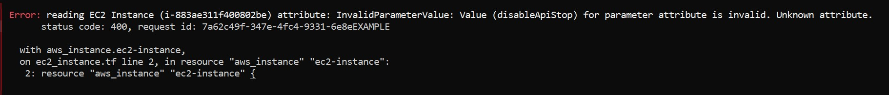
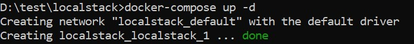
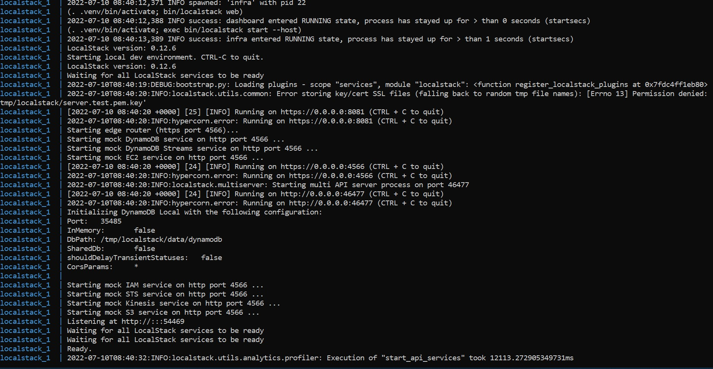
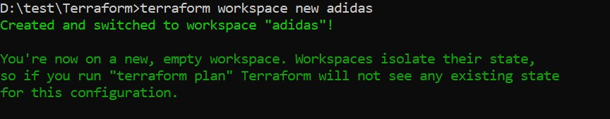
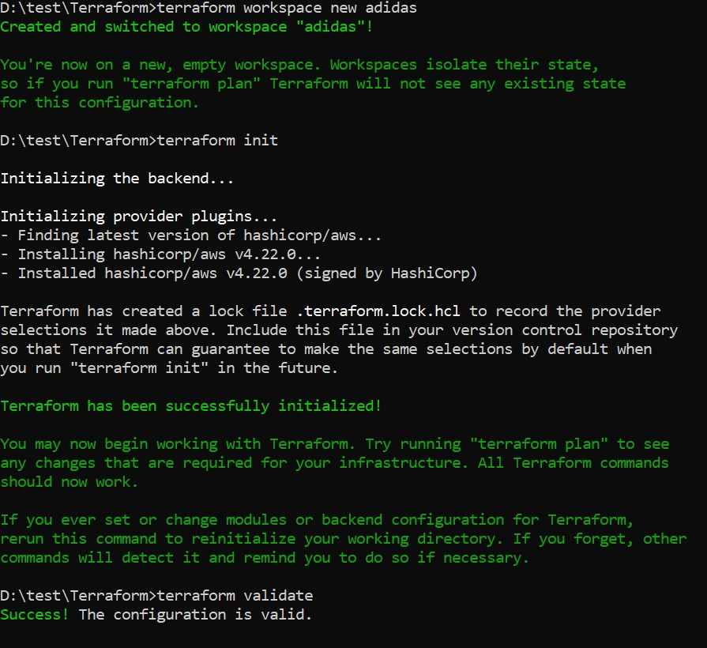
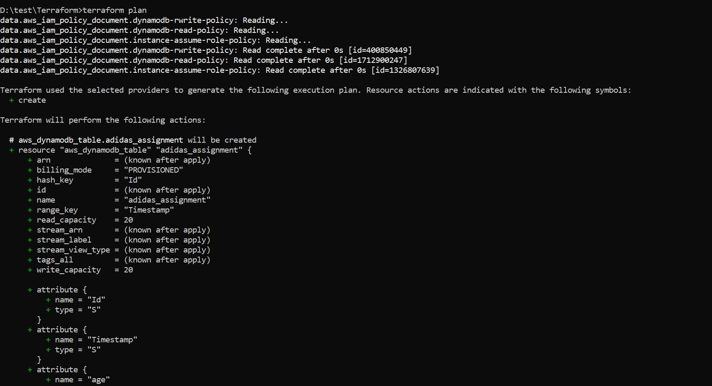
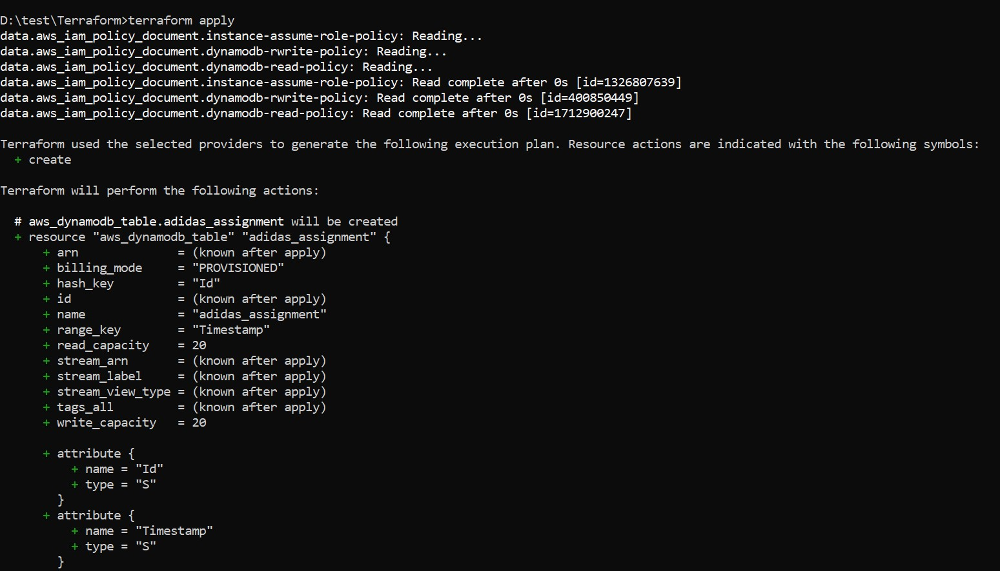
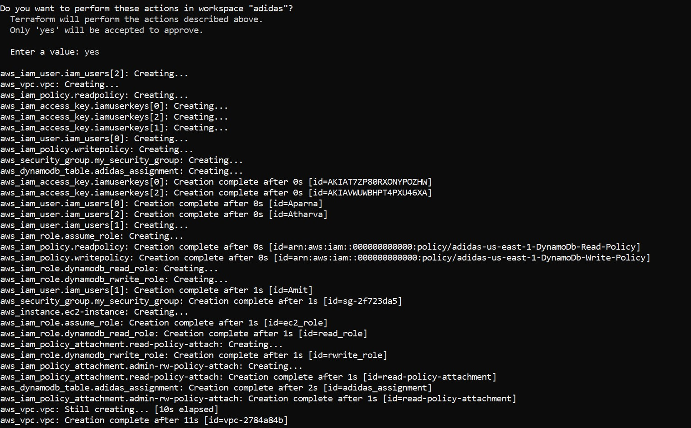
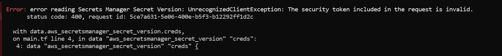

# This is a basic assignment that consists creating of terraform scripts to deploy an EC2 instance thereby connect to dynamodb database

## Tools Used
1. Localstack
**Description: [https://github.com/localstack/localstack]**
2. Terraform
**Description: [https://www.terraform.io/docs]**

###### *Note: Here I am using localstack which is use for testing AWS services on local system.Localstack mocks the AWS services on your local  system to which you can get access and perform operations.
###### During setup of localstack docker instance , it is found that localstack has bugs and even creating an EC2 instance on localstack is somehow not possible.You can mock the ec2 instance as a service on localstack but I got everytime below error*

```javascript
 Error: reading EC2 Instance (i-b48cffc5156363285) attribute: InvalidParameterValue: Value (disableApiStop) for parameter attribute is invalid. Unknown attribute.
│       status code: 400, request id: 7a62c49f-347e-4fc4-9331-6e8eEXAMPLE
│
│   with aws_instance.ec2-instance,
│   on ec2_instance.tf line 2, in resource "aws_instance" "ec2-instance":
│    2: resource "aws_instance" "ec2-instance" {
```




>When I googled out found that Localstack Pro version supports creating of EC2 instance inside docker but community edition has some limitations.
Even localstack 0.14.0 version has some bugs which doesn't allow to up the services and even after 24hrs it hangs and services are in "Available" state not in running state when you use below URL-
http:\\localhost:4566\health.
So I found that localstack version 0.12.6 is working fine on Windows

## Setup Localstack
>Prerequisites: 
1. Python 3.10 + along with pip packages 
2. Install the Docker  and Docker Compose on your system first before starting to install localstack using pip.

>Steps:
1. Create the docker-compose.yml file that contains the localstack configuration (see file localstack/docker-compose.yml).
Below are some important tags in file for configuration -
- Image : Image Version of localstack to download and start within a docker.
- Services : Services to start as a mock services like ec2,iam,dynamodb
- Ports : you can provide ports here but after a specific version of localstack all the services run on port 4566.

2. Inside the directory localstack execute 

```javascript 
docker-compose up -d
```
>To view runtime logs

```javascript 
docker compose logs -f
```
>You can seen various services have been started as a mock service on port 4566.
Above command will start localstack within docker as a container.





## Setup Terraform-

1. For WIndows download the pre compiled binaries from the official site of Terraform.
**https://www.terraform.io/downloads** 

2. Include the Path Terraform/terraform.exe in your environment variables.

3. Create the various "tf" Scripts(refer the scripts in Terraform folder) on basis of your requirement to deploy the EC2 ,dynamodb ,IAM ,sts resources on AWS (Here Localstack).
    
- main.tf  (This script contains provider code)
- IAM_Roles.tf (This script contains iam role creation code)
- IAM_Policies.tf (This script contains iam policies creation code)
- IAM.tf (This script contains iam user creation code)
- ec2_instance.tf (This script contains ec2 instance creation code)
- dynamoDB.tf (This script contains dynamodb creation code)
- Attach_Roles_Policies.tf (This script contains roles-policy attach code)
- AssumePolicy.tf (This script contains trust policy code)
- variables.tf (This script contains variables that refers in various scripts)
- security_group.tf (This script contains custom security group creation code)
- vpc_creation.tf (This script contains vpc creation code)
- outputs.tf (This script contains output of execution)

4.  From directory Terraform , execute -
```javascript 

terraform workspace new adidas --- create new workspace and switch to it
terraform init  -- this will initalize the terraform directory and create provider.
terraform validate  --this will validate all the tf files configs
terraform plan -- this will generate the plan of terraform execution
terraform apply -- this commands finally creates all the resources on localstack and deploy everthing from creating vpc , subnets,gateways,ec2 , security groups,IAM users,roles , policies , dynamodb to attach policies to role and assign role to IAM users.
```












>In above scripts creation of EC2 instance exhibits error as explained above and aws_secretsmanager_secret_version  secret_sting functionality through which access key and secret key can be used without compormise.




